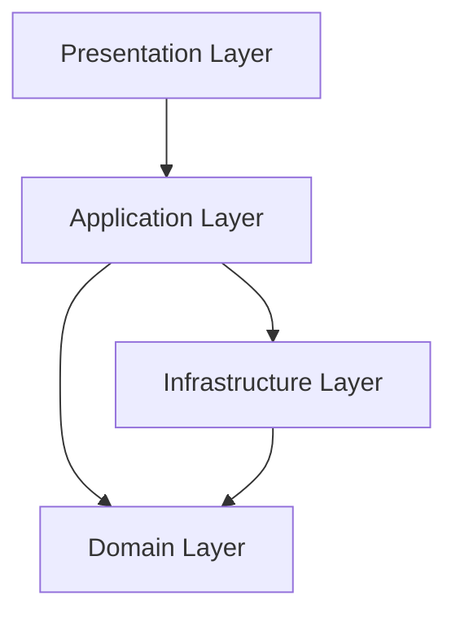
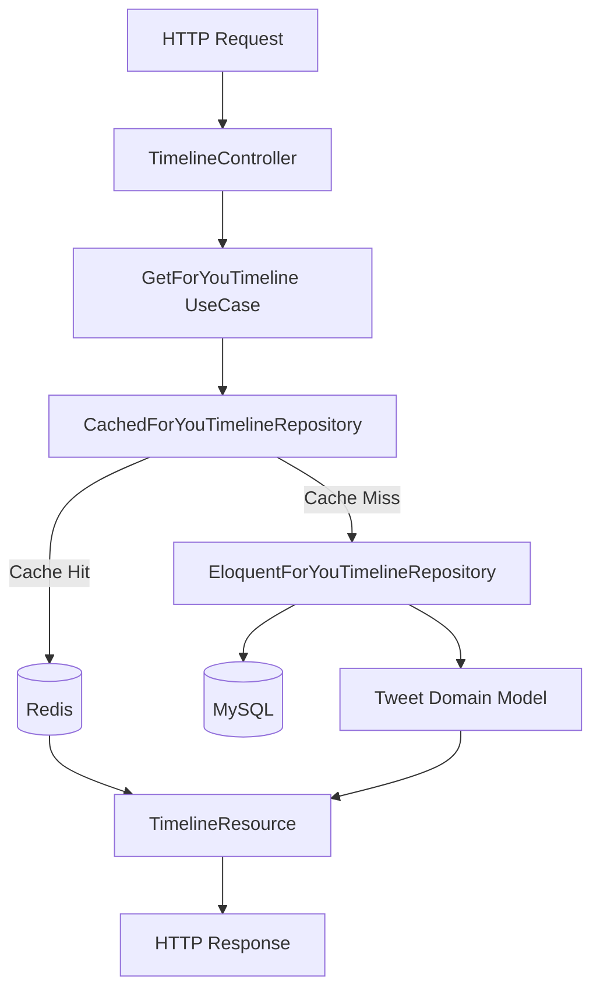

## 🏗️ Arquitectura

Este proyecto implementa una arquitectura de monolito modular junto con Domain-Driven Design (DDD), siguiendo los principios SOLID. La estructura del proyecto está organizada en capas y modulos:

### Alto nivel de las Capas de la Arquitectura


#### 1. Presentation Layer (`src/*/Presentation/`)
- Controllers: Manejan las peticiones HTTP
- Resources: Transforman los datos para la respuesta
- Middleware: Validación y autenticación

#### 2. Application Layer (`src/*/App/`)
- FormRequest: Validación de datos
- Rules: Validaciones personalizadas para los FormRequest

#### 3. Domain Layer (`src/*/Domain/`)
- Entities: Modelos de dominio
- Value Objects: Objetos inmutables
- Repository Interfaces: Contratos para persistencia

#### 4. Infrastructure Layer (`src/*/Infrastructure/`)
- Repositories: Implementaciones de persistencia
- Persistence: Modelos Eloquent y Factories

#### 5. Shared Layer (`src/Shared/`)
- Exceptions: Excepciones personalizadas
- Models: Modelos de dominio compartidos
- Todo lo que se pueda compartir entre modulos, pero no sea del Core.

### Patrones de Diseño Implementados
- Repository Pattern: Abstracción de la persistencia
- Decorator Pattern: Para el caching de repositorios
- Factory Pattern: Creación de objetos
- Resource Pattern: Transformación de datos

### Diagrama del flujo de los Timeline

### Capas y Responsabilidades

#### 1. Presentation Layer (`src/Timeline/Presentation/`)
- `TimelineController`: Recibe la petición HTTP y la delega al caso de uso
- `TimelineResource`: Transforma el modelo de dominio en JSON
- `TimelineCollection`: Maneja la paginación y metadata

#### 2. Application Layer (`src/Timeline/App/`)
- `GetForYouTimeline`: Orquesta la obtención del timeline
- `GetFollowingTimeline`: Orquesta la obtención del timeline de seguidos

#### 3. Domain Layer (`src/Timeline/Domain/`)
- `Tweet`: Modelo de dominio con reglas de negocio
- `ForYouTimelineRepositoryInterface`: Contrato para obtener el timeline
- `FollowingTimelineRepositoryInterface`: Contrato para timeline de seguidos

#### 4. Infrastructure Layer (`src/Timeline/Infrastructure/`)
- `CachedForYouTimelineRepository`: Implementa cache con Redis
- `EloquentForYouTimelineRepository`: Implementa persistencia con MySQL
- `TweetEloquentModel`: Modelo Eloquent para interacción con DB

## 🚀 Características

- Timeline "For You"
- Timeline "Following"
- Caché con Redis
- Paginación por cursor
- Tests automatizados
- Docker y Kubernetes para despliegue

## 🛠️ Tecnologías

- PHP 8.2
- Laravel 10
- Redis
- Docker
- Kubernetes
- MySQL

## 📦 Instalación

1. Clonar el repositorio
```bash
git clone https://github.com/AlejoFM/tweeter-uala-backend.git
```
2. Instalar dependencias
```bash
composer install
```
3. Configurar variables de entorno
```bash
cp .env.example .env
```
4. Generar key de aplicación
```bash
php artisan key:generate
```
5. Ejecutar migraciones
```bash
php artisan migrate
```
[ Opcional ] : Ejecutar seeders

```bash
php artisan db:seed
```
6. Ejecutar servidor

```bash
php artisan serve
```

## 🐳 Docker

### Desarrollo local
```bash
docker-compose up -d
```

### Despliegue en Kubernetes
```bash
.docker/scripts/deploy.sh
```

### Entornos de despliegue 
- `kubectl apply -k k8s/environments/dev` : Desarrollo
- `kubectl apply -k k8s/environments/prod` : Producción

## 🧪 Testing

### Ejecutar todos los tests
```bash
php artisan test
```

### Ejecutar un módulo de tests específico
```bash
php artisan test tests/Tweet.php
php artisan test tests/User.php
php artisan test tests/Timeline.php
```

## 📚 Documentación

### Swagger
```bash
php artisan l5-swagger:generate
```
- La documentación está disponible en `/docs/swagger`

## 📈 Escalabilidad

- HPA (Horizontal Pod Autoscaling) configurado
- Caché distribuida con Redis
- Índices optimizados en MySQL
- Paginación eficiente por cursor

## Apagar el proyecto
Kubernetes
```bash
kubectl delete deployments --all --all-namespaces
kubectl delete services --all --all-namespaces --field-selector metadata.name!=kubernetes
kubectl delete pods --all --all-namespaces
```
Docker
```bash
docker-compose down --volumes --remove-orphans
```

## Validar si el proyecto se apagó correctamente
```bash
kubectl get pods --all-namespaces
docker ps
```
## Grafana
- Grafana está disponible en `http://localhost:3000`
- Credenciales: `admin / admin`

## Prometheus
- Prometheus está disponible en `http://localhost:9090`

## 📝 Comentarios y justificaciones

### Arquitectura y Escalabilidad
- Se optó por un monolito modular con DDD en lugar de microservicios para mantener la simplicidad inicial del desarrollo y aprovechar las capacidades modulares de Laravel.
- La escalabilidad se maneja mediante Kubernetes, permitiendo escalado horizontal automático basado en CPU/memoria.
- Se eligió Redis para optimización de lecturas por su simplicidad y efectividad, en lugar de implementar CQRS o MongoDB en esta etapa inicial.
- En caso de necesitar optimizar aún más la lectura, se podrían replicar las tablas de tweets y usuarios en distintas bases de datos, y usar Redis para cachear las queries de los timelines de cada usuario. Al replicar las tablas
va a existir consistencia eventual, pero es minimo y no afectaría el funcionamiento del sistema si se pushean los datos actualizados listos para la lectura cada n cantidad de tiempo.
- Gracias a Kubernetes, con HPA y un balanceador de carga, se puede escalar el sistema horizontalmente de forma automática y balancear la carga de requests entre los pods.

### Decisiones Técnicas
- Se añadió Rate Limiting para prevenir ataques DDOS y sobrecarga del sistema.
- Se añadió Grafana para monitorear el sistema. 

### Infraestructura
- Kubernetes se utiliza para auto-healing y gestión de pods, garantizando alta disponibilidad.
- La arquitectura permite una futura migración a microservicios si fuera necesario.
- Se priorizó una solución robusta pero simple, evitando la complejidad innecesaria de sistemas de mensajería como RabbitMQ o Kafka en esta etapa.